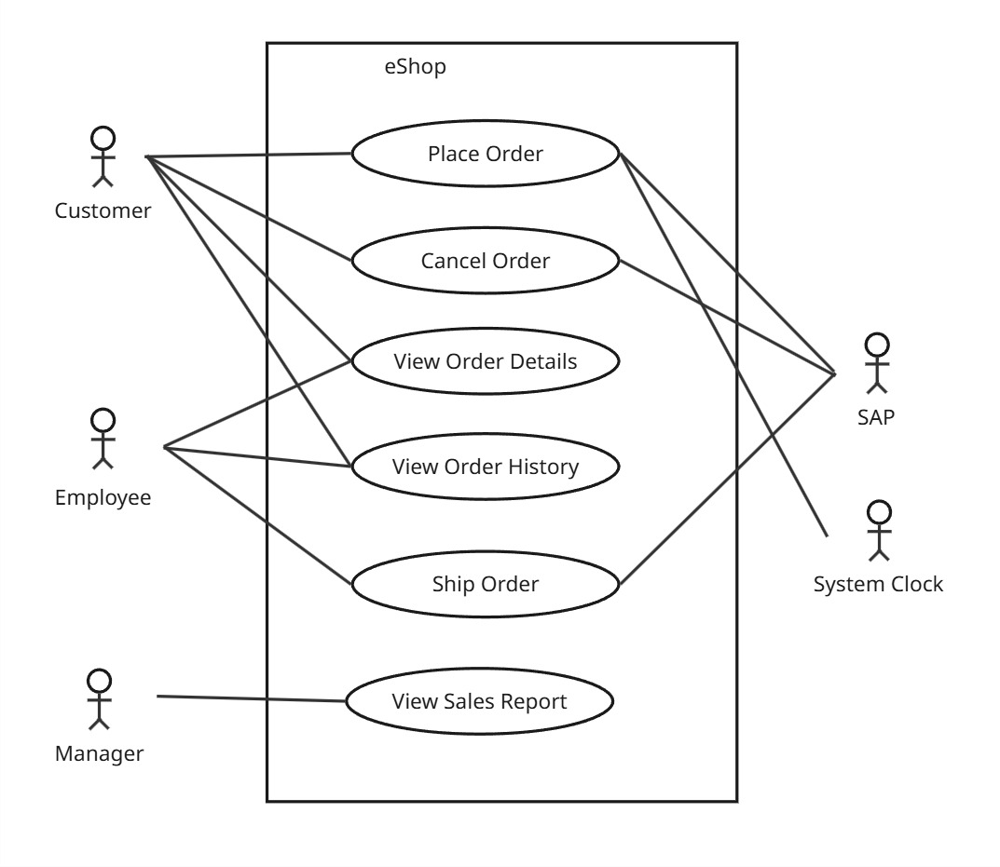

# System Behavior

## Use Case Diagram

Primary Actors:
- Customers
- Employees
- Managers

Use Cases:
- Place Order
- Cancel Order
- View Order Details
- View Order History
- Ship Order
- View Sales Report

Secondary Actors:
- SAP

## Use Case Narrative: Place Order

### Use Case Name
Place Order

### Primary Actor
Customer

### Goal
The customer successfully places an order for a product.

### Preconditions
- The customer is registered and logged into the system.
- The products to be ordered are available in stock.
- The product master data is available from SAP.

### Main Success Scenario
1. The customer browses the product catalog.
2. The system retrieves product master data from SAP.
3. The customer selects one product.
4. The customer enters the desired quantity.
5. The customer submits the order.
6. The system validates product availability using SAP.
7. The system creates the order as a draft.
8. The system reserves the products in SAP.
9. The system marks order status as reserved.
10. The system provides an order confirmation to the customer.

### Extensions (Alternative Flows)
- 2a. SAP is unavailable:
    - The system notifies the customer that product information cannot be retrieved at this time.
- 3a. Product not available:
    - The system notifies the customer and suggests removing or replacing unavailable items.
- 4a. Non-positive quantity:
    - The system notifies the customer and suggests entering a valid quantity.
- 9a. SAP is unavailable:
    - The system notifies the customer that product reservation cannot be made at this time.

### Postconditions
- The order is created and stored in the system.
- The customer receives an order confirmation.
- The products have been reserved in SAP.

## Use Case Narrative: Cancel Order

### Use Case Name
Cancel Order

### Primary Actor
Customer

### Goal
The customer successfully cancels an order that has not yet been shipped.

### Preconditions
- The customer is registered and logged into the system.
- The order exists and has not yet been shipped.

### Main Success Scenario
1. The customer views their list of orders.
2. The customer selects an order to cancel.
3. The system checks if the order is eligible for cancellation (not shipped).
4. The customer confirms the cancellation.
5. The system cancels the order.
7. The system notifies the customer of the successful cancellation.

### Extensions (Alternative Flows)
- 3a. Order already shipped:
	- The system notifies the customer that the order cannot be canceled.

### Postconditions
- The order status is updated to "Canceled."
- The customer is notified of the cancellation.

## Use Case Narrative: View Order Details

In a Real Life Project, we would write Use Case Narratives for the other Use Cases too. In this Sandbox Project, I've ommitted writing the other Use Cases.