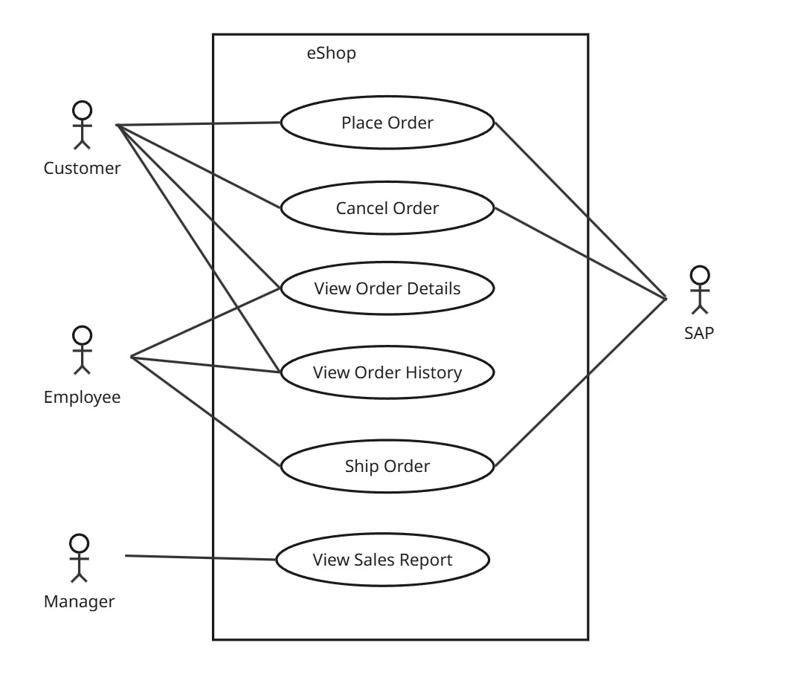

# System Behavior

## Use Case Diagram

Primary Actors:
- Customers
- Employees
- Managers

Use Cases:
- Place Order
- Cancel Order
- View Order Details
- View Order History
- Ship Order
- View Sales Report

Secondary Actors:
- SAP
- System Clock